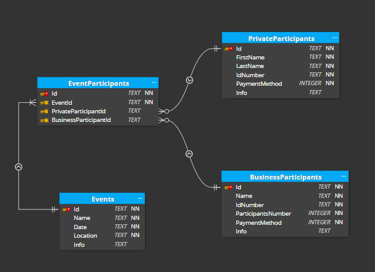

# Event management system

This is a web application developed to manage guest registrations for events, allowing users to add/edit future events, view past events, and manage attendees. 

## Technology stack

### Backend:
-ASP.NET
-EntityFramework Core 

### Frontend:
-React

## Architecture

The application follows clean architecture design principles and utilizes a layered architecture with appropriate design patterns such as weak coupling between layers, dependency injection, and inversion of control. 

### Domain Layer: 

Contains the business logic and entities. It’s the base layer with no dependencies on other layers.

### Application layer

Contains application-specific logic. It orchestrates how the domain objects are used to perform specific tasks pertinent to the application. It uses `mediator pattern` to decouple layers by allowing indirect communication between parts of the application.

Logic is represented with the `CQRS (Command Query Responsibility Segregation)` pattern, which separates the application into two parts: `Commands` and `Queries`. Commands are responsible for modifying the state of the application while Queries are responsible for retrieving data from the application. 

### Infrastructure layer

Defines how data that is initially held in domain entities, is held in databases or other permanent storage.

## Client application

Client is built using `React` framework.

### Home Page
Displays a lists of past and future events with essential details.
Provides options to add and relete future events.

### Event Addition View:
Allows users to add new event via a user-friendly form.

### Event View:
Presents event information alongside with list of particiants for a event, with option to delete participants from this event. Also it provides separate form for adding private or business participants.

### Participant Details View:
Allows viewing and editing of participant details originally entered during participant addition.

# Run Application

## Backend
From root folder navigate to `Wed` project and run `dotnet run` It will run backend on port `5180`.

## Client
From cluent submodule repository: `npm install` and `npm run dev`
It will run client application on port `5173`.
